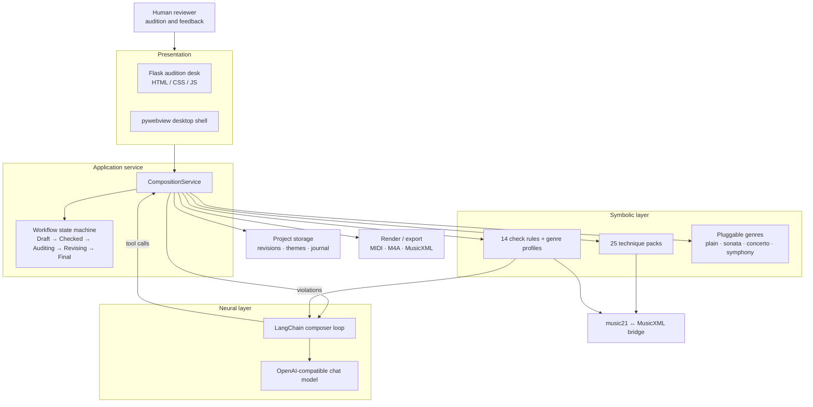

<!--
SPDX-FileCopyrightText: 2026 xhdlphzr
SPDX-License-Identifier: MIT
-->

# HarmoniaTextor

[](https://github.com/xhdlphzr/HarmoniaTextor/stargazers)
[](https://github.com/xhdlphzr/HarmoniaTextor/issues)
[](https://github.com/xhdlphzr/HarmoniaTextor/pulls)
[](https://github.com/xhdlphzr/HarmoniaTextor/blob/main/LICENSE)
[](https://github.com/xhdlphzr/HarmoniaTextor)
[](https://github.com/xhdlphzr/HarmoniaTextor)
[](https://github.com/xhdlphzr/HarmoniaTextor)

[](https://github.com/xhdlphzr/HarmoniaTextor)
[](https://github.com/xhdlphzr/HarmoniaTextor/blob/main/README.md)
[](https://github.com/xhdlphzr/HarmoniaTextor/blob/main/docs/README.zh.md)

Neuro-symbolic Bach-style music generation. A large language model acts as the composer while a deterministic symbolic layer (technique packs, counterpoint checkers and a pluggable genre framework) validates and materialises every decision as MusicXML.

## Architecture



## Features

- Fully automatic composer agent: type a prompt, press generate, and the ReAct loop runs to completion, feeding symbolic violations back until the score passes. The agent chooses the key and mode (major/minor) itself when it submits the theme, develops the melody with the technique packs, keeps the rhythm layered rather than monotonous, and when it rewrites the MusicXML adds ornaments, varies notes and leaves rests for breathing room. It titles the work itself (falling back to the genre name).
- Two-step composer session: Step 1 plans every instrument and its emotional arc, Step 2 composes in the *same* session; the plan is shown live and stored per work.
- Independent reviewer AI ("check AI"): after the symbolic layer passes, a brand-new review session inspects the score; on rejection its suggestions go back into the *same* creator session and work continues. The verdict and suggestions are shown live in the UI and stored per work.
- Automatic context compression at 90% of the model window keeps long sessions running without losing the goal or the current score.
- 25 Bach composition techniques (imitation, inversion, sequence, stretto, rondo, ...).
- 14 symbolic counterpoint checks with genre-aware rule profiles.
- Pluggable genres: plain, sonata, concerto, symphony.
- Instrument-aware parts: the agent chooses a voice slot and an instrument and may add several parts for the same instrument (e.g. `violin1`, `violin2`).
- Single-page web desk: live progress, live staff-notation rendering (OpenSheetMusicDisplay) that refreshes as the score grows (all instruments on their own staves), auto-played audio, finalize/feedback and export.
- Full-score revision model with rollback and audit journal.
- SQLite project database at `~/.harmonia_textor/history.db`.
- Native pywebview desktop shell.
- Exports MusicXML, staff PNG, M4A and MP3 into `~/Downloads`; a work with several movements is exported as a single zip archive.
- Prompt box with Enter-to-newline that grows up to 13 lines, then scrolls.
- Fully offline UI: Alex Brush (OFL-1.1) and OpenSheetMusicDisplay (BSD-3-Clause) are bundled locally; no web-font or CDN requests.

## Quick start

Requires [uv](https://docs.astral.sh/uv/) and Python 3.14+.

```console
uv sync --group dev
uv run pytest
uv run ht                     # native desktop window
```

`ht` launches the pywebview desktop shell, which is a core dependency and works out of the box on Windows and macOS. On Linux, install the Qt WebEngine backend first with `uv sync --extra desktop --group dev`.

## Storage

Works, movements, revisions, themes and journals live in a single SQLite database at `~/.harmonia_textor/history.db` (override the directory with `HARMONIA_DATA`). Exports are written next to it.

## API configuration

The composer agent reads `~/.harmonia_textor/config.json`; edit it from the gear button in the desktop app:

```json
{
  "base_url": "https://api.openai.com/v1",
  "api_key": "",
  "model": "gpt-4o-mini",
  "context_window": 200
}
```

The same endpoint drives both the composer and the independent reviewer. Settings resolve in this order: explicit arguments, then this file, then the `LLM_BASE_URL` / `LLM_API_KEY` / `LLM_MODEL` environment variables, then the built-in defaults.

## Audio backend

M4A/MP3 export needs [FluidSynth](https://www.fluidsynth.org/), a General MIDI soundfont and `ffmpeg`. On first launch the desktop app downloads all three into `~/.harmonia_textor/vendor` in the background, so a fresh machine can play and export audio without any manual setup, and a failed download simply leaves audio unavailable. Point `HARMONIA_SOUNDFONT` at a custom `.sf2`/`.sf3` file to override the soundfont. The audition desk renders staff notation live with OpenSheetMusicDisplay and can save it as a PNG without any server-side engraver.

## Quality gates

CI enforces the full gate on Ubuntu. Run it locally with:

```console
uv lock --check
uv run reuse lint
uv run pytest
uv run ruff check .
uv run mypy --strict .
uv run ruff format --check .
uv run ruff check --select D .
```

`uv run pytest` is preconfigured with `--cov=src --cov=app --cov-report=term --cov-fail-under=100`, so a bare command runs the full coverage gate.

## Docker

```console
sh scripts/docker-build.sh            # or: pwsh scripts/docker-build.ps1
sh scripts/docker-run.sh              # serves http://localhost:5000
sh scripts/docker-push.sh ghcr.io/<user>/harmoniatextor:latest
```

PowerShell equivalents live alongside the shell scripts in `scripts/`.

## Desktop packaging

PyInstaller bundles are described by the cross-platform `HarmoniaTextor.spec`:

```console
uv sync --extra desktop --group dev
uv run --no-sync pyinstaller --noconfirm --clean HarmoniaTextor.spec
```

On release, CD builds the bundle on Windows, macOS and Ubuntu and uploads 1 GiB split archives to the GitHub release. Windows uses `assets/Franx.ico`, macOS uses `assets/Franx.icns`, Linux uses the default icon.

## License

MIT. See [`LICENSES/MIT.txt`](LICENSES/MIT.txt). The icons under `assets/` are licensed under CC-BY-NC-ND-4.0. The audio backend components downloaded on first launch keep their own licenses (ffmpeg, FluidSynth and the GeneralUser GS soundfont).
