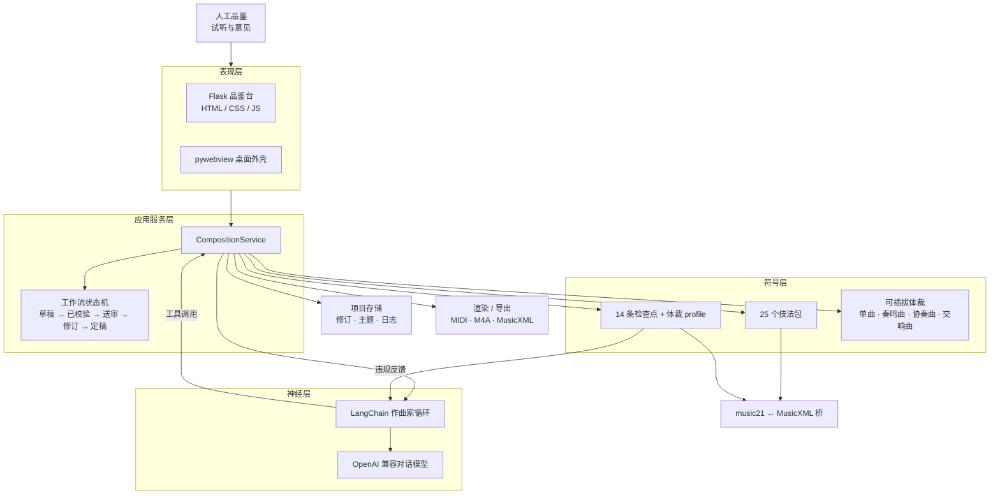

<!--
SPDX-FileCopyrightText: 2026 xhdlphzr
SPDX-License-Identifier: MIT
-->

# HarmoniaTextor

[](https://github.com/xhdlphzr/HarmoniaTextor/stargazers)
[](https://github.com/xhdlphzr/HarmoniaTextor/issues)
[](https://github.com/xhdlphzr/HarmoniaTextor/pulls)
[](https://github.com/xhdlphzr/HarmoniaTextor/blob/master/LICENSE)
[](https://github.com/xhdlphzr/HarmoniaTextor)
[](https://github.com/xhdlphzr/HarmoniaTextor)
[](https://github.com/xhdlphzr/HarmoniaTextor)

[](https://github.com/xhdlphzr/HarmoniaTextor)
[](https://github.com/xhdlphzr/HarmoniaTextor/blob/master/README.md)
[](https://github.com/xhdlphzr/HarmoniaTextor/blob/master/docs/README.zh.md)

神经符号巴赫风格音乐生成。大语言模型担任作曲家，而确定性的符号层（技法包、对位检查
点、可插拔体裁框架）负责校验并把每一个决定落地为 MusicXML。

英文文档：[`README.md`](../README.md)。

## 架构



## 功能

- 全自动作曲智能体：输入提示词点击生成后，ReAct 循环自动跑到底，把符号层违规
  回喂给模型直到通过。调式由智能体在提交主题时自行决定（大调/小调），之后用技法
  包发展旋律，保持节奏的层次感而不单调，并在覆写 MusicXML 时加入装饰音、调整部分音、
  适当留白以增加呼吸感。标题也由智能体自行拟定（未拟定则用体裁名作标题）。
- 两阶段创作会话：Step 1 先规划全部乐器与各声部情感走向，Step 2 在**同一会话**中
  实际作曲；规划会实时显示并按作品保存。
- 独立检查 AI：符号层通过后，检查 AI 会开启**全新会话**审阅乐谱；打回时把具体
  意见交回**同一个创作会话**继续修改。评审结论与建议会实时显示在界面，并按作品
  保存。
- 会话达到模型上下文窗口的 90% 时自动压缩为结构化摘要并继续，不丢失目标与当前
  乐谱。
- 25 个巴赫创作技法（模仿、倒影、模进、密接和应、回旋曲式……）。
- 14 条符号层对位检查点，支持按体裁生效的规则 profile。
- 可插拔体裁：单曲、奏鸣曲、协奏曲、交响曲。
- 乐器化声部：智能体在选主题之外还要选声部槽位与乐器，并可为同种乐器编写多个
  声部（如 `violin1`、`violin2`）。
- 单页 Web 工作台：实时进度、随乐谱增长实时刷新的五线谱渲染（OpenSheetMusicDisplay，
  每个乐器各自一条谱表）、自动播放音频、定稿/提意见与导出。
- 全量快照修订模型，支持回退与审计日志。
- SQLite 作品数据库：`~/.harmonia_textor/history.db`。
- pywebview 原生桌面外壳。
- 导出 MusicXML、五线谱 PNG、M4A 与 MP3 到 `~/Downloads`；多乐章作品打包为一个
  zip 压缩包。
- 创作提示词输入框：Enter 换行，最多自动扩展到 13 行，超出后框内滚动。
- 界面完全离线：Alex Brush（OFL-1.1）与 OpenSheetMusicDisplay（BSD-3-Clause）
  本地内置，不请求网络字体或 CDN。

## 快速开始

需要 [uv](https://docs.astral.sh/uv/) 与 Python 3.14+。

```console
uv sync --group dev
uv run pytest
uv run ht                     # 原生桌面窗口
```

`ht` 启动 pywebview 桌面壳，已作为核心依赖，Windows 与 macOS 上开箱即用。Linux 需要先
安装 Qt WebEngine 后端：`uv sync --extra desktop --group dev`。

## 存储

作品、乐章、修订、主题与日志统一存放在 SQLite 数据库
`~/.harmonia_textor/history.db`（可用 `HARMONIA_DATA` 覆盖目录）。导出文件也在
该目录旁生成。

## API 配置

作曲家智能体读取 `~/.harmonia_textor/config.json`，可在桌面界面点击右上角齿轮按钮编辑：

```json
{
  "base_url": "https://api.openai.com/v1",
  "api_key": "",
  "model": "gpt-4o-mini",
  "context_window": 200
}
```

创作 AI 与独立的检查 AI 共用同一个接口。

配置优先级：显式参数 > 该配置文件 > 环境变量 `LLM_BASE_URL` / `LLM_API_KEY` /
`LLM_MODEL` > 内置默认值。

## 音频后端

M4A/MP3 导出依赖 [FluidSynth](https://www.fluidsynth.org/)、General MIDI 音色库
与 `ffmpeg`。可用以下命令把前两者下载到被 git 忽略的 `vendor/` 目录：

```console
uv run python tools/fetch_vendor.py
```

`ffmpeg` 会先在 `vendor/bin` 查找，再到系统 `PATH` 查找。设置环境变量
`HARMONIA_SOUNDFONT` 可指定自定义 `.sf2`/`.sf3`。试听台用
OpenSheetMusicDisplay 实时渲染五线谱，并可导出 PNG，无需服务端制谱器。

## 质量门禁

CI 在 Ubuntu 上执行完整门禁。本地运行：

```console
uv lock --check
uv run reuse lint
uv run pytest
uv run ruff check .
uv run mypy --strict .
uv run ruff format --check .
uv run ruff check --select D .
```

`uv run pytest` 已固定
`--cov=src --cov=app --cov-report=term --cov-fail-under=100`，直接运行即完成覆盖率门禁。

## Docker

```console
sh scripts/docker-build.sh            # 或：pwsh scripts/docker-build.ps1
sh scripts/docker-run.sh              # 访问 http://localhost:5000
sh scripts/docker-push.sh ghcr.io/<user>/harmoniatextor:latest
```

PowerShell 版本与 shell 脚本并列放在 `scripts/` 目录。

## 桌面打包

PyInstaller 打包由跨平台的 `HarmoniaTextor.spec` 描述：

```console
uv sync --extra desktop --group dev
uv run --no-sync pyinstaller --noconfirm --clean HarmoniaTextor.spec
```

发布时，CD 会在 Windows、macOS 与 Ubuntu 上分别构建，并以每卷 1 GiB 的分卷上传到
GitHub Release。Windows 使用 `assets/Franx.ico`，macOS 使用 `assets/Franx.icns`，
Linux 使用默认图标。

## 贡献

见 [`CONTRIBUTING.md`](../CONTRIBUTING.md)（英文）与
[`docs/CONTRIBUTING.zh.md`](CONTRIBUTING.zh.md)（中文）。

## 许可证

MIT，见 [`LICENSES/MIT.txt`](../LICENSES/MIT.txt)。`assets/` 下的图标使用
CC-BY-NC-ND-4.0。内嵌二进制保留各自许可证；见 `vendor/README-LICENSES.md`。
